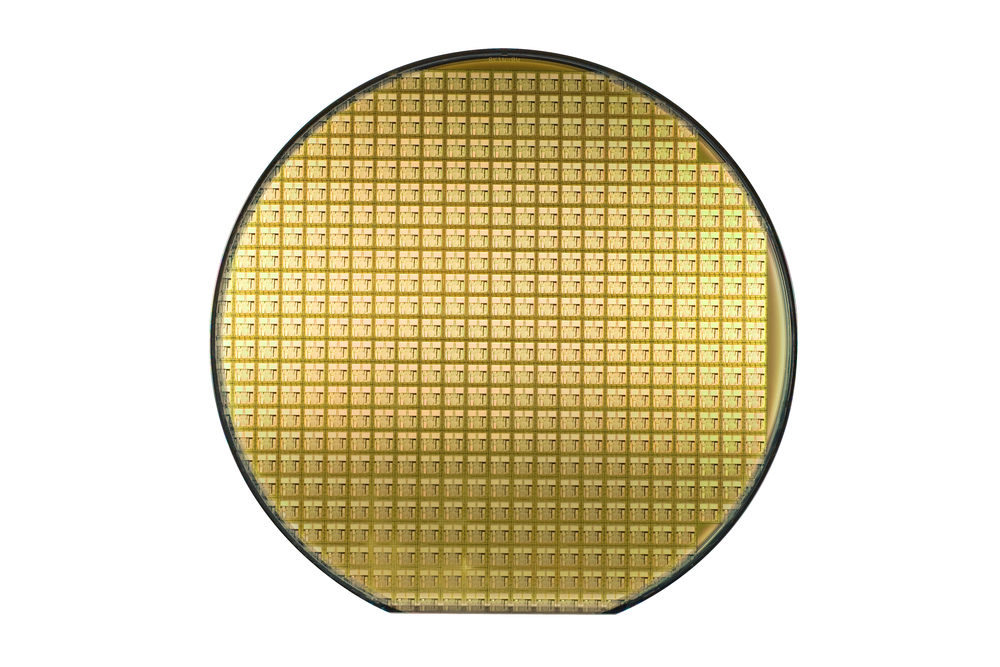
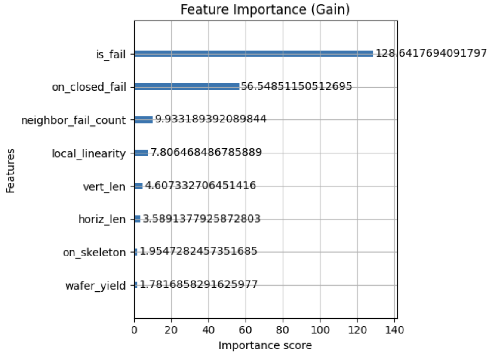
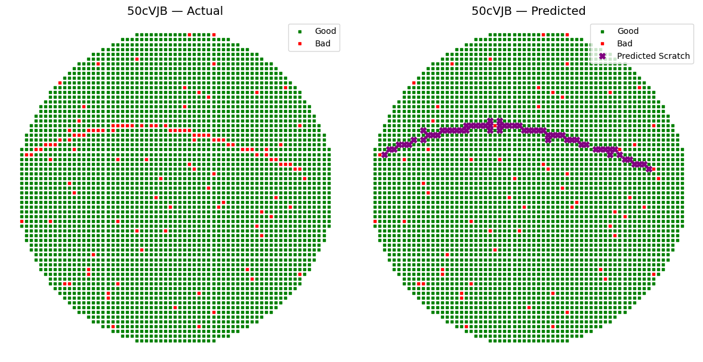
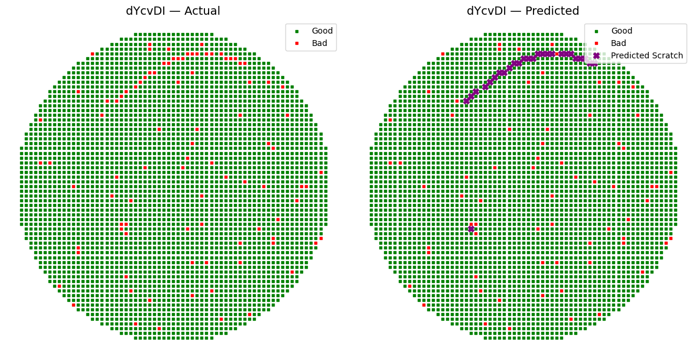

# Scratch Detection in Semiconductor Wafer Maps

This project explores **automatic detection of scratch defects** in semiconductor wafer maps using **gradient-boosted trees (GBT/XGBoost)**.

Scratches typically appear as **linear tracks** across adjacent dies, leading to significant yield loss. Detecting them early is critical for semiconductor process control and defect analysis.

---

## Introduction:

In the semiconductor industry, **"wafers"** are thin discs of semiconductor material, such as silicon, used to fabricate microelectronic devices such as transistors, integrated circuits, and other components. A single wafer can contain hundreds or thousands of individual devices, known as **"dies"**, which are typically cut or "diced" from the wafer after the manufacturing process is completed.

<figure>
  
  <figcaption>Fig.1 - An example of a standard wafer</figcaption>
</figure>

One of the challenges in manufacturing wafers is to identify and isolate defects, including scratches, which can affect the performance and reliability of the resulting devices.

Scratches are seen as elongated clusters of bad dies that have a high aspect ratio, meaning they are relatively thin and long compared to their width. They can be caused by equipment misalignment or mishandling by humans, and may contain latent defects that can affect the performance of the devices. Scratches may not always be continuous, so sometimes there may be good dies within the scratch. These good dies are often marked for removal in a manual process called "**Inked dies**"

<figure>
  
  <figcaption>Fig.2 - A scratch on a wafer - an optical view</figcaption>
</figure>

In the data there are faulty dies that are part of a scratch, which are labeled as "Scratch" as well as a few good dies that are part of a scratch, which are labeled as "Ink."

The data that you received is called **"wafer map"** as it maps the status of all dies in the wafer.

The dies in the wafers are tested in a large number of stations, operations, and in each operation it is possible to create a map of the dies in this operation by coloring the good dies in a certain color and the faulty dies in another color.

<figure>
  
  <figcaption>Fig.3 - A logical wafer map in a certain operation. good dies in green and bad dies in red</figcaption>
</figure>

## 📊 Dataset

The dataset contains die-level wafer map information:

- **WaferName** – wafer identifier
- **DieX, DieY** – grid coordinates of each die
- **IsGoodDie** – 1/0 indicator for good dies
- **IsScratchDie** – 1/0 indicator for scratch-affected dies

> Full training and testing CSVs are included in this repo (`wafers_train.csv`, `wafers_test.csv`).  
> Additionally, sample wafer map images and prediction overlays are available under `results/`.

---

## Approach
# Data Preparation

   - Wafer map CSVs converted into spatial grids.
   - Patches extracted around each die for local context.


# Modeling

- **GBT/XGBoost baseline**: trained on neighborhood features for fast, interpretable predictions.

# Engineered spatial features

- **Basic fail indicator** (`is_fail`)  
  A binary flag marking whether a die is good or bad.

- **Streak lengths** (`horiz_len`, `vert_len`)  
  Longest contiguous runs of failed dies in horizontal and vertical directions.

- **Neighbor-based count** (`neighbor_fail_count`)  
  Number of immediately adjacent failed dies.

- **Skeleton membership** (`on_skeleton`)  
  Whether a die lies on the 1-pixel-wide skeleton of the binary failure map.

- **Local linearity** (`local_linearity`)  
  R² score from fitting a straight line through local fail-die coordinates.

- **Wafer yield** (`wafer_yield`)  
  The overall good-die percentage, Also used to filter out low-yield wafers before prediction and training.

- **Closed-loop region** (`on_closed_fail`)  
  Indicates if a die falls within a region formed by applying a morphological **closing** (dilation followed by erosion) on the fail map, which “closes” small holes and captures inked dies.

# Features Explored

- **Patch-CNN prototype**  
  Extracted 5×5 die patches for a convolutional approach—**abandoned** when training on full dataset took days on my PC.
- **Two-hop fail count** (`two_hop_fail_count`)  
  Count of failed dies two steps away—initially included to capture broader clusters but **dropped** after it generated many false positives on isolated noise.

## Evaluation

   - Visualization: overlay predicted scratches on wafer maps.

## Results
   - XGBoost provides a competitive baseline with lower compute cost.
   - Visualizations highlight good vs. scratch dies across wafers.

## Model Performance

On the held-out validation set (10% of wafers), the final XGBoost model achieved:

- **Precision**: 82.0%
- **Recall**: 73.3%
- **F1 Score**: 0.774
- **AUC**: 0.996
- **Optimal threshold**: 0.725

## Model Interpretability

<p align="center">
  
</p>

## 📸 Results

Example wafer map overlays showing detected scratches:

<p align="center">
  
  
</p>

## ⚙️ How to Run

```bash
# Create environment
python -m venv .venv && source .venv/bin/activate
pip install -r requirements.txt

# Run the notebook
jupyter lab notebooks/scratch_detection.ipynb

```

### Summary of Features and Methodology

This solution is based on geometric and topological features extracted per die. I used simple yet expressive features like neighbor fail count, streak lengths, and linearity of failed dies. The modeling approach relied on XGBoost, a tree-based method well-suited for tabular, sparse, and structured data.

Instead of deep learning, I prioritized speed and interpretability by handcrafting spatial features and tuning the model using Optuna.

Final outputs were filtered using wafer-level yield constraints and refined with threshold tuning on validation data.

### Additional Thoughts & Future Improvements

Several directions could meaningfully enhance this solution in terms of both performance and robustness:

**Advanced spatial features:** While current features capture neighborhood and linearity, further spatial descriptors could be valuable. For instance, measuring the length, width, or orientation consistency of scratch segments would better describe the physical geometry of defects and allow the model to distinguish scratches from random failures.

**Denoising through preprocessing:** Isolated bad dies (false positives) can mislead the classifier. Applying morphological filters before feature extraction could suppress this noise. Alternatively, a simple learned autoencoder could help to perform noise reduction on the wafer map (removing isolated bad dies).

**Segmentation-first approaches:** Instead of directly classifying dies, I could first segment the scratch area using a pre-trained models or traditional morphological methods. Then, each die would receive additional features such as "scratch mask membership" or "distance to scratch center," improving contextual understanding.

**CNN-based patch classifiers:** A convolutional neural network trained on small patches of the wafer (e.g., 5×5 or 7×7 grids) could learn spatial features directly from the raw die map, without manual engineering. This would be particularly useful for capturing irregular or fragmented scratches that are not in linear patterns. Though slower to train, once optimized, these models can run efficiently at inference time.

**Dynamic thresholding / confidence calibration:** A fixed decision threshold may not suit all wafers, especially those with low yield. Calibrating thresholds per wafer, based on its yiel or die count could balance false positives and negatives more effectively.
